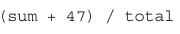
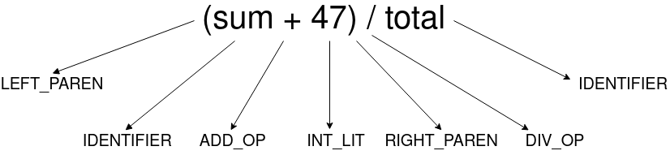

# Lexer

## O que é

Analisador léxico basedo em um exemplo retirado do livro Conceitos de Linguagem de Programação por Robert W. Sebesta e utilizado como caso de estudo para a matéria de Linguagens de Programação.

## Execução

Para compilar o Analisador Léxico basta executar make dentro da pasta do repositório e o binário do programa estará disponível para ser utilizado.

`$ make`

`$ ./lexer`

## Tabela de lexemas e tokens

Este lexer tem como objetivo reconhecer expressões matemáticas simples, na tabela abaixo são mostrados os lexemas e seus tokens correspondentes que são aceitos pelo programa.

|      Lexema      |    Token    |
| :--------------: | :---------: |
|     Variável     | IDENTIFIER  |
|        =         |  ASSIGN_OP  |
|        +         |   ADD_OP    |
|        -         |   SUB_OP    |
|        \*        |   MULT_OP   |
|        /         |   DIV_OP    |
|        (         | LEFT_PAREN  |
|        )         | RIGHT_PAREN |
| Final de Arquivo |     EOF     |

## Exemplo de saída

Utilizando a seguinte expressão como exemplo:

O lexer deve retornar como resultado os seguintes tokens:

